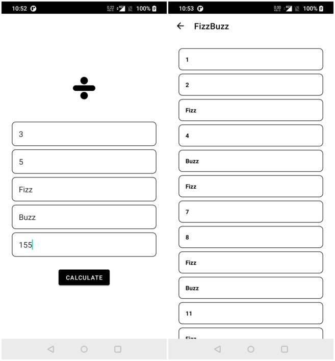
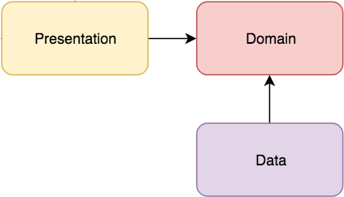
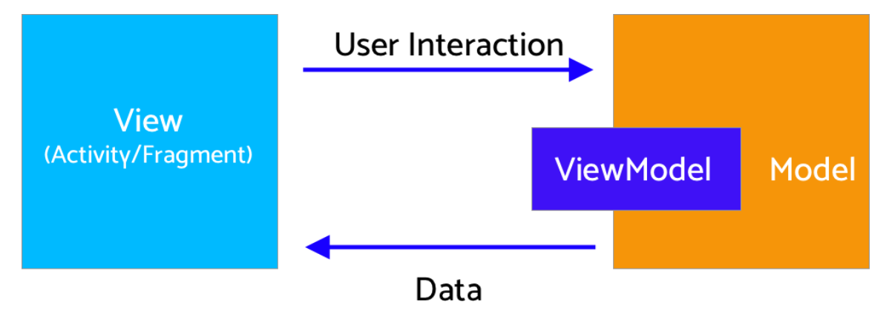

# FizzBuzzApp

Our App is designed to calculate and replace a list of numbers divisible by the numbers entered by
the user.

The app consists of two screens:

* __Form screen__ : where the user can input the rules of the game.
* __Result screen__ : where the user can visualise the result of the calculation. In the result
  screen we opted for a pagination system that loads each time a page of 100 elements to avoid
  making big calculations that the user might not need.

Our code base consists of three modules:

* __Domain: Business Logic Layer__ : Is responsible for the business logic. It contains our use
  cases.
* __Data: Data Access Layer__ : It includes the domain layer and implement the interfaces exposed by
  the domain.
* __App: Presentation Layer__ : Is responsible for presenting the data and for interacting with the
  Android Framework.

The presentation layer is designed based on the MVI pattern:

This pattern consists of three layers:

* __Model__: It is considered as the single source of truth. It contains all the information
  necessary to render the view correctly.
* __Intent__: A representation of the app/user interactions that are sent to the model by the view.
* __View__: Represents the ui (activities/fragments). It would listen for the state changes sent by
  the model.

For developing our app we used the following libraries:

* __Hilt__: For dependency injection.
* __Navigation Jetpack__: For the navigation between our fragments(you can find the navigation graph
  in main_graph).
* __Coroutines__: To execute our code asynchronously. We used coroutines flow the assure the
  communication between our views and viewModels.
* __JUnit5__: For our unit tests.
* __Mockk__: Used to mock our objects in unit tests.
* __Turbine__: Used to test our coroutines flows and states.

__With more time available__:

* Rewrite the ui layer using jetpack compose.
* Add more tests and maybe some end to end tests.

